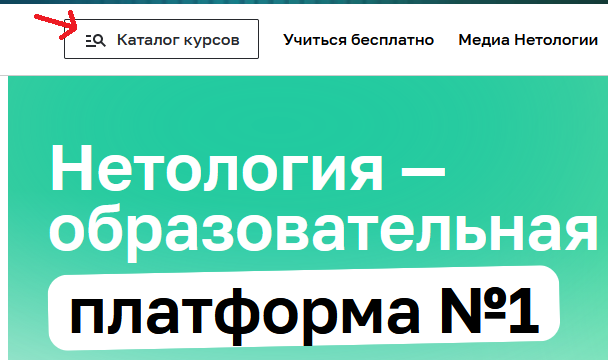
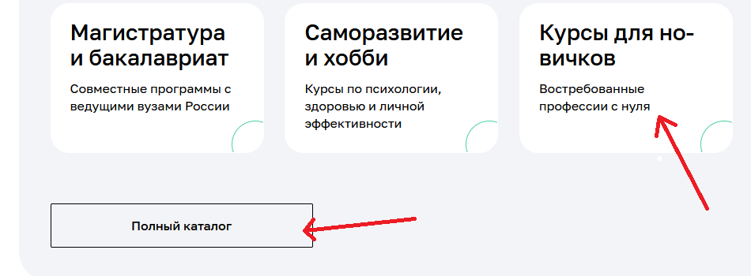
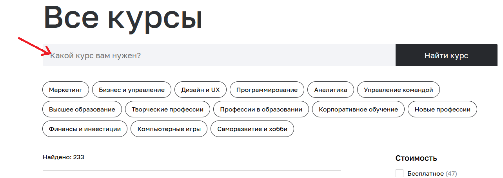
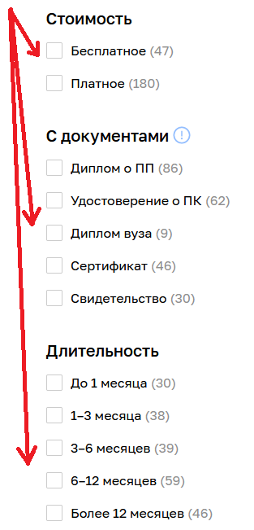
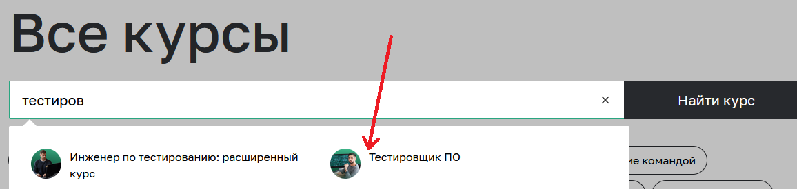
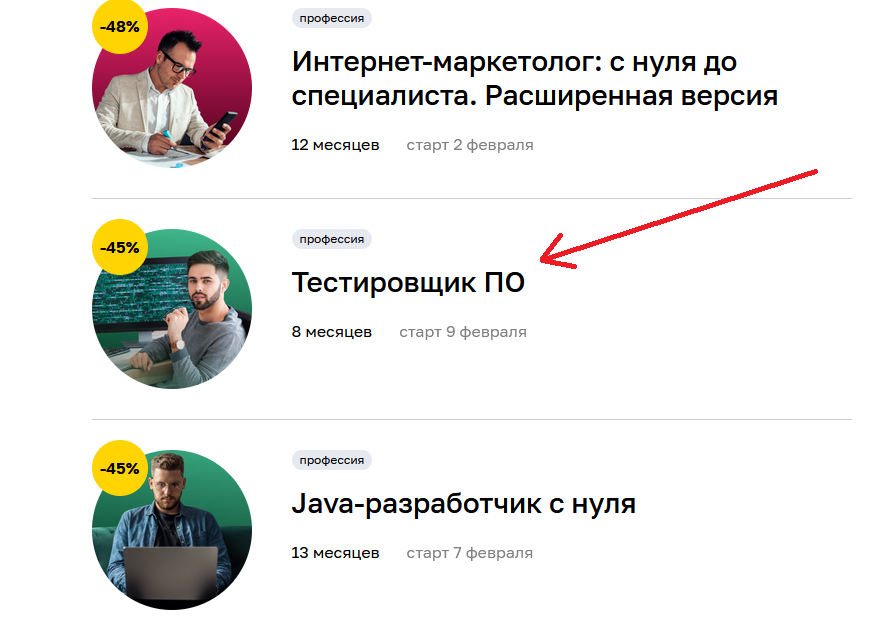
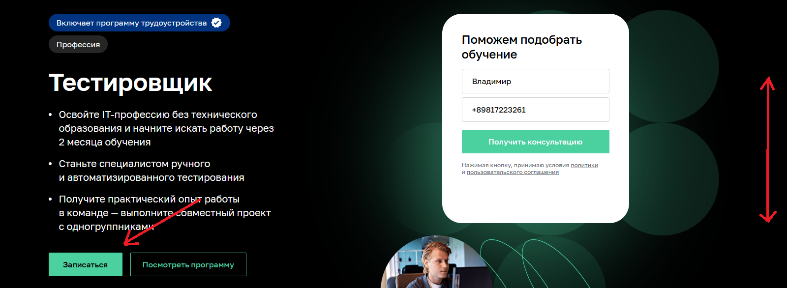
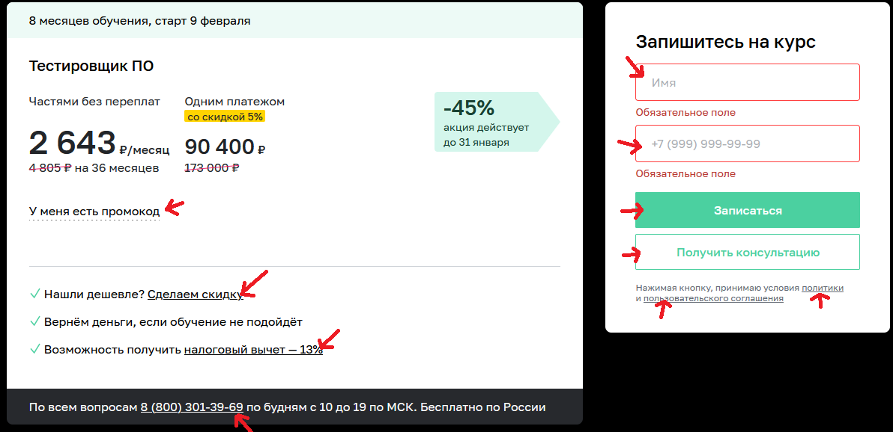
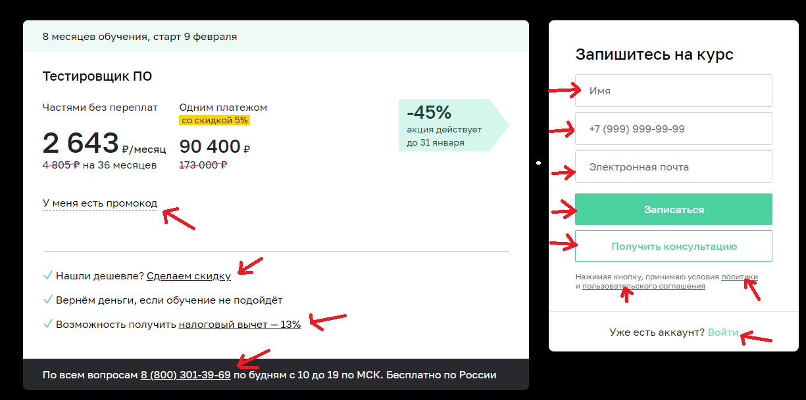
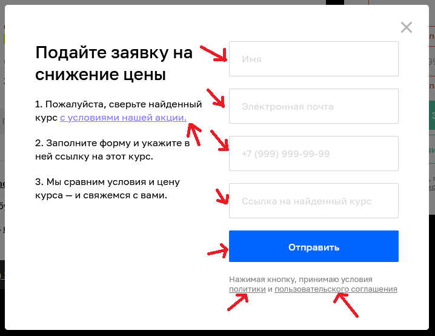

# План тестирования возможности записаться на обучение профессии «Тестировщик ПО»

## Перечень автоматизируемых сценариев.

1. Поиск курса: 

       1. Ввести название курса в поисковой строке на главной странице. 
           Ожидаемый результат: Вывод нескольких курсов соответствующих запросу 
           и наличие среди них искомого на первом месте.

       2. Переход по иконкам меню: "Курсы для новичков" или "Полный каталог".
           Ожидаемый результат: Кликнув что на одну, что на другую кнопку осуществляется переход на страницу "Все курсы".

         
       3. Ввести название курса в поисковой строке на странице "Все курсы".
           Ожидаемый результат: Вывод нескольких курсов соответствующих запросу 
           и наличие среди них искомого на первом месте.

          Осуществить ручной поиск путем просмотра каталога с помощию скрола мыши, полосы прокрутки, 
          а также клавиш вниз/вверх и PgUp/PgDn.
           Ожидаемы результат: все варианты позволяют прокручивать список курсов и обнаружить искомый.

       4. Сокращение списка курсов посредством выбора фильтров на странице "Все курсы.
          Фильтры соответствующие курсу: Стоимость - Платное; С документами - Диплом о ПП; 
          Длительность - 6-12 месяцев; Уровень - Новичкам; Навыки - Тестирование ПО.
           Ожидаемый результат: Фильтры кликабельны и функционируют; 
           Список предлагаемых курсов сократится, до нескольких среди которых будет искомый или до одного искомого.

2. Переход на курс после нахождения его.

       Проверка кликабельности найденного курса и перехода на страницу курса:
       После нахождения его в поисковой строке на главной странице Нетологии.
       После нахождения его в посиковой строке на странице "Все курсы".
       После нахождения его среди списка курсов на странице "Все курсы".
        Ожидаемый результат: при нажатии любого из вариантов осуществляется переход на страницу курса.

   
3. Возможность перейти к меню "записаться" на странице курса. 
    
        1. Посредством кнопки "записаться" на странице выбранного курса.
            Ожидаемый результат: страница прокручивается в самый низ к меню записи на курс.
        2. Посредством скрола, полосы прокрутки, а также клавиш вниз/вверх и PgUp/PgDn 
           осуществить переход вниз страницы до меню "Записаться".
            Ожидаемый результат: Все варианты позволяюют добраться до искомого меню.

4. Скриншоты меню записаться с указанием на объекты проверки для зарегистрированного/незарегистрированного пользователя.

5. Проверка кнопок и работа ссылок в меню записи для зарегистрированного и незарегистрированного пользователей.

        1. Кликабельность кнопок и работа ссылок: 
           Политики.
            Ожидание: переход на страницу с описанием политик обработки данных.
           Пользовательское соглашение. 
            Ожидание: переход на страницу с описанием пользовательского соглашение.
           Налоговый вычет.
            Ожидание: переход на страницу с описанием налогового вычета и его получением.
           8 (800) 301-39-69.
            Ожидание: предложение выбрать приложение для звонка для ПК 
             или выход на набор номера для телефона.
           Войти. (для незарегистрированного пользователся)
            Ожидание: переход на страниуц входа в личный кабинет.

6. Применение промокода в меню записи для зарегистрированного и незарегистрированного пользователей.
   
        1. Кликабельность кнопки "У меня есть промокод".
            Ожидание: открытие форы поля для ввода промокода и кнопки "Применить".
        2. Ввод валидного промокода (получить у HR) и нажатие кнопки "Применить".
            Ожидание: код применен, ошибки не выдается. (Возможно измениться цена курса)
        3. Ввод невалидного промокода и нажатие кнопки "Применить".
            Ожидание: выдача ошибки, что-то вроде "Данный промокод неприменим".
        4. Ввод пустого промокода и нажатие кнопки "Применить".
            Ожидание: выдача ошибки, что-то вроде "Введите промокод".

7. Валидная проверка записи для зарегистрированного (Поля "Имя" и "Телефон") 
   и незарегистрированного (Поля "Имя", "Телефон" и "Электронная почта") пользователей.
   Валидные данные используемые для проверки: Имя - Вася, Телефон - +7(981)654-32-10, 
   Электронная почта - test@test.test.

           1. Ввод валидных данных в поля "Имя", "Телефон" и "Электронная почта", после нажатие кнопки "Записаться".
               Ожидание: переход на страницу выбора оплаты курса.
           2. Ввод валидных данных в поля "Имя", "Телефон" и "Электронная почта", 
               после нажатие кнопки "Получить консультацию".
               Ожидание: вывод сообщение, что-то вроде "Ваша заявка принята, ожидайте, с вами свяжуться"
           3. Тестирование формы "Имя" на валидные значения. 
              Ввод валидных данных в поле "Телефон","Электронная почта" и тестовых данных в поле "Имя",
              после нажатие кнопки "Записаться":
               Ввод имени на кирилице (Вася). Ожидание: переход на страницу выбора оплаты курса.
               Ввод имени на кирилице с буквами "Ё" и "Й"(Васё и Васяй). Ожидание: переход на страницу выбора оплаты курса.
               Ввод имени на латинице (Vasya). Ожидание: переход на страницу выбора оплаты курса.
               Ввод двойного имени, через пробел (Ва ся). Ожидание: переход на страницу выбора оплаты курса.
               Ввод двойного имени, через тире (Ва-ся). Ожидание: переход на страницу выбора оплаты курса.
               Ввод имени с разным регистром (вАсЯ). Ожидание: переход на страницу выбора оплаты курса.
               Ввод имени с апострофом (В'ася). Ожидание: переход на страницу выбора оплаты курса.
           4. Тестирование формы "Телефон" на валидные значения. 
              Ввод валидных данных в поле "Имя","Электронная почта" и тестовых данных в поле "Телефон",
              после нажатие кнопки "Записаться":
               Ввод 11 цифр (79999999999). Ожидание: переход на страницу выбора оплаты курса.
               Ввод 11 цифр используя символы "+" "(" ")" "-" (+7(999)999-99-99). Ожидание: переход на страницу выбора оплаты курса.
               Ввод 11 цифр через пробел (7 999 999 99 99). Ожидание: переход на страницу выбора оплаты курса.
           5. Тестирование формы "Электронная почта" на валидные значения. 
              Ввод валидных данных в поле "Имя","Телефон" и тестовых данных в поле "Электронная почта",
              после нажатие кнопки "Записаться" (Стандарт для почты ***@почта.домен):
               Ввод почты на латинице (Test@Gmail.com). Ожидание: переход на страницу выбора оплаты курса.
               Ввод почты на кирилице (тест@gmail.com). Ожидание: переход на страницу выбора оплаты курса.
               Ввод почты с использованием цифр (test213@mail.ru). Ожидание: переход на страницу выбора оплаты курса.
               Ввод почты используя символ "!" (test!@mail.ru). Ожидание: переход на страницу выбора оплаты курса.

8. Невалидная проверка записи для зарегистрированного (Поля "Имя" и "Телефон")
   и незарегистрированного (Поля "Имя", "Телефон" и "Электронная почта") пользователей.
   Валидные данные используемые для проверки: Имя - Вася, Телефон - +7(981)654-32-10,
   Электронная почта - test@test.test.

           1. Тестирование формы "Имя" на невалидные значения. 
              Ввод валидных данных в поле "Телефон","Электронная почта" и тестовых данных в поле "Имя",
              после нажатие кнопки "Записаться":
               Ввод пустых данных (ничего не вводить). Ожидание: Ошибка "Обязательное поле".
               Ввод 1го символа (F). Ожидание: Ошибка "Должно быть не короче 2 символов".
               Ввод цифр (12345). Ожидание: Ошибка "Должно состоять из букв".
               Ввод символов и спецсимволов кроме апострофа (!, @, #, $, %, ^, &, *). Ошибка "Должно состоять из букв".
               Ввод более 50 символов . Ожидание: Ошибка "Должно быть не длинее 50 символов".
           2. Тестирование формы "Телефон" на невалидные значения. 
              Ввод валидных данных в поле "Имя","Электронная почта" и тестовых данных в поле "Телефон",
              после нажатие кнопки "Записаться":
               Ввод 10 цифр (8 981 654 32 1). Ожидание: Ошибка "Номер в формате +9 (999) 999-99-99".
               Ввод 12 цифр (8 981 654 32 101). Ожидание: Ошибка "Номер в формате +9 (999) 999-99-99".
               Ввод букв (т еку 981 32 32 ). Ожидание: Ошибка "Номер в формате +9 (999) 999-99-99".
               Ввод символов кроме "+" "(" ")" "-" (по очереди добавить к номеру "{}", "[]", "<>"). Ожидание: Ошибка "Номер в формате +9 (999) 999-99-99".
               Ввод спецсимволов (по очереди добавить к номеру !, @, #, $, %, ^, &, *. ). Ожидание: Ошибка "Номер в формате +9 (999) 999-99-99".
           5. Тестирование формы "Электронная почта" на невалидные значения. 
              Ввод валидных данных в поле "Имя","Телефон" и тестовых данных в поле "Электронная почта",
              после нажатие кнопки "Записаться" (Стандарт для почты название@ресурс.домен):
               Ввод с нарушением стандарта (test.test). Ожидание: ошибка "Неверный email".
               Ввод почты на кирилице (test@тест.ру). Ожидание: ошибка "Неверный email"..
               Ввод почты используя символы кроме "!"("№;%?*@gmail.com ) . Ожидание: ошибка "Неверный email".
               Ввод почты используя цифры (test@12343.32). Ожидание: ошибка "Неверный email".

9. Проверка возможности запросить скидку.
   Валидные данные используемые для проверки: Имя - Вася, Телефон - +7(981)654-32-10,
   Электронная почта - test@test.test, ссылка на курс - https://netology.ru.
   Тестовые данные - аналогично п.7 и п.8, для поля "ссылка на курс" данные будут ниже. 

         Скриншот меню для проверки скидки:

        1. Кликабельность кнопок и работа ссылок: 
           Политики.
            Ожидание: переход на страницу с описанием политик обработки данных.
           Пользовательское соглашение. 
            Ожидание: переход на страницу с описанием пользовательского соглашение.
           "с условиями нашей акции".
            Ожидание: переход на страницу с описанием условий акции.
        2. Ввод валидных данных в поля "Имя", "Телефон", "Электронная почта" и "ссылка на курс",
           после нажатие кнопки "Отправить".
            Ожидание: ответ "Ваш запрос принят, с вами свяжутся для уточнения стоимости".
        3. Тестирование формы "Имя" на валидные значения.
            Ввод валидных данных в поле "Телефон","Электронная почта", "Ссылка на найденный курс"
            и тестовых данных в поле "Имя", после нажатие кнопки "Записаться":
             Ввод имени на кирилице.
              Ожидание: ответ "Ваш запрос принят, с вами свяжутся для уточнения стоимости".
             Ввод имени на кирилице с буквами "Ё" и "Й".
              Ожидание: ответ "Ваш запрос принят, с вами свяжутся для уточнения стоимости".
             Ввод имени на латинице.
              Ожидание: ответ "Ваш запрос принят, с вами свяжутся для уточнения стоимости".
             Ввод двойного имени, через пробел.
              Ожидание: ответ "Ваш запрос принят, с вами свяжутся для уточнения стоимости".
             Ввод двойного имени, через тире.
              Ожидание: ответ "Ваш запрос принят, с вами свяжутся для уточнения стоимости".
             Ввод имени с разным регистром.
              Ожидание: ответ "Ваш запрос принят, с вами свяжутся для уточнения стоимости".
             Ввод имени с апострофом.
              Ожидание: ответ "Ваш запрос принят, с вами свяжутся для уточнения стоимости".
        4. Тестирование формы "Телефон" на валидные значения.
            Ввод валидных данных в поле "Имя","Электронная почта", "Ссылка на найденный курс"
            и тестовых данных в поле "Телефон", после нажатие кнопки "Записаться":
             Ввод 11 цифр.
              Ожидание: ответ "Ваш запрос принят, с вами свяжутся для уточнения стоимости".
             Ввод 11 цифр используя символы "+" "(" ")" "-".
              Ожидание: ответ "Ваш запрос принят, с вами свяжутся для уточнения стоимости".
             Ввод 11 цифр через пробел.
              Ожидание: ответ "Ваш запрос принят, с вами свяжутся для уточнения стоимости".
        5. Тестирование формы "Электронная почта" на валидные значения.
            Ввод валидных данных в поле "Имя","Телефон", "Ссылка на найденный курс"
            и тестовых данных в поле "Электронная почта", после нажатие кнопки "Записаться"
            (Стандарт для почты ***@почта.домен):
             Ввод почты на латинице.
              Ожидание: ответ "Ваш запрос принят, с вами свяжутся для уточнения стоимости".
             Ввод почты на кирилице.
              Ожидание: ответ "Ваш запрос принят, с вами свяжутся для уточнения стоимости".
             Ввод почты с использованием цифр.
              Ожидание: ответ "Ваш запрос принят, с вами свяжутся для уточнения стоимости".
             Ввод почты используя символ "!".
              Ожидание: ответ "Ваш запрос принят, с вами свяжутся для уточнения стоимости".
        6. Тестирование формы "Ссылка на найденный курс" на валидные значения.
            Ввод валидных данных в поле "Имя","Телефон", "Электронная почта"
            и тестовых данных в поле "Ссылка на найденный курс", после нажатие кнопки "Записаться":
             Ввод в поле всех возможных букв и символов, в количестве больше 1го (ya.ru и любая длинная ссылка).
              Ожидание: ответ "Ваш запрос принят, с вами свяжутся для уточнения стоимости".
        7. Тестирование формы "Имя" на невалидные значения.
            Ввод валидных данных в поле "Телефон","Электронная почта", "Ссылка на найденный курс"
            и тестовых данных в поле "Имя", после нажатие кнопки "Записаться":
               Ввод пустых данных (ничего не вводить). Ожидание: Ошибка "Обязательное поле".
               Ввод 1го символа. Ожидание: Ошибка "Должно быть не короче 2 символов".
               Ввод цифр. Ожидание: Ошибка "Должно состоять из букв".
               Ввод символов и спецсимволов кроме апострофа. Ошибка "Должно состоять из букв".
               Ввод более 50 символов. Ожидание: Ошибка "Должно быть не длинее 50 символов".
        8. Тестирование формы "Телефон" на невалидные значения. 
            Ввод валидных данных в поле "Имя","Электронная почта", "Ссылка на найденный курс"
            и тестовых данных в поле "Телефон", после нажатие кнопки "Записаться":
               Ввод 10 цифр. Ожидание: Ошибка "Номер в формате +9 (999) 999-99-99".
               Ввод 12 цифр. Ожидание: Ошибка "Номер в формате +9 (999) 999-99-99".
               Ввод букв. Ожидание: Ошибка "Номер в формате +9 (999) 999-99-99".
               Ввод символов кроме "+" "(" ")" "-". Ожидание: Ошибка "Номер в формате +9 (999) 999-99-99".
               Ввод спецсимволов. Ожидание: Ошибка "Номер в формате +9 (999) 999-99-99".
        9. Тестирование формы "Электронная почта" на невалидные значения. 
            Ввод валидных данных в поле "Имя","Телефон", "Ссылка на найденный курс"
            и тестовых данных в поле "Электронная почта", после нажатие кнопки "Записаться"
            (Стандарт для почты ***@почта.домен):
               Ввод с нарушением стандарта. Ожидание: ошибка "Неверный email".
               Ввод почты на кирилице. Ожидание: ошибка "Неверный email"..
               Ввод почты используя символы кроме "!". Ожидание: ошибка "Неверный email".
               Ввод почты используя цифры. Ожидание: ошибка "Неверный email".
        10. Тестирование формы "Ссылка на найденный курс" на невалидные значения.
            Ввод валидных данных в поле "Имя","Телефон", "Электронная почта"
            и тестовых данных в поле "Ссылка на найденный курс", после нажатие кнопки "Записаться":
             Ввод в поле пустого значения (ничего не вводить).
              Ожидание: Ошибка "Обязательное поле".

10. Проверка подсветки кликабельных кнопок и ссылок в меню записи.

        1. Проверить что при наведении курсора на кнопку или ссылку она выделяется изменением цвета.
            Перечень кнопок и ссылок:
             "политики"
             "пользовательского соглашения"
             "налоговый вычет — 13%"
             "Сделаем скидку"
             "У меня есть промокод"
             "8 (800) 301-39-69 "
             "Записаться"
             "Получить консультацию"
             "Войти" (для незарегистрированного пользователся)

## Перечень используемых инструментов с обоснованием выбора

    1. IntelliJ IDEA упрощения взаимодействия с кодом и модулями.
    2. Модуль JUnit 5 как удобный язык для автоматизации тестирования.
    3. Модуль slf4j - библиотека для протоколирования.
    4. Модуль Selenium с расширением Selenide для взаимодействия с web-формами.
    5. Возможно пригодится postman, если будет нужно делать запросы сразу на бекэнд или БД.
    6. Модуль Lombok для сокращения размеров кода
    7. Возможно модуль faker, для генерации различных данных.
    9. Модули allure и reportportal для выгрузки логов и составления отчетов
    10. Настроенный CI (Gradle Report), для автопроверки тестов на GitHub
    11. Основные браузеры: Хром, Firefox, опера, edge (стоит прогнать тесты на каждом, мало ли где сбой)
   
## Перечень необходимых разрешений, данных и доступов.
   
    1. Потребуются письменные разрешения и согласования от руководства IT-подразделения Нетологии. 
    2. При неизвестной структуре организации знать о работах должны те, кто отвечает за данный ресурс. 
       Это могут быть: администраторы сайта, разработчики, сисадмины и helpdesk, и.т.п.
    3. Стоит запросить доступы к базе данных и API сайта, т.к. они могут пригодиться для проверке ожидаемых результатов.
   
## Перечень и описание возможных рисков при автоматизации.

    1. Риски сбоев баз данных при внесении данных которы БД может не уметь распознавать.
    2. Может начать тормозить, повиснуть или вообще лечь сайт Нетологии.
    3. Если вдруг произойдет недопонимание с отделом, обрабатывающим заявки, 
       тестовые заявки могут начать обрабатывать (а их может оказаться много).
    4. Из-за возможных сбоев сайт может не суметь корректно обработать реальных новых пользователей.
    5. Трудности могут возникнуть при поиске локаторов элементов на страницах, далеко не все имеют явные привязки.
       В ходе выполнения проекта может измениться структура сайта и локаторы придётся уточнять.

## Перечень необходимых специалистов для автоматизации.

    Для выполнения данного проекта будет достаточно одного инженера тестировщика автоматизатора, 
    он должен обладать всеми необходимыми компетенциями.
    Очень вероятно что ему придется взаимодействовать с другими специалистами компании, как то:
    1. Администратор сайта.
    2. Разработчик бекенда.
    3. Разработчик фронтенда.
    4. Сисадмин.
    5. Оператор HelpDesk

## Интервальная оценка с учётом рисков в часах.

    Самый большой риск, что повредится БД, т.к восстанавливаться она может и 8, и 10 и 24 часа.
    Самый вероятный риск в том, что повиснет сайт, а это ориентировочно 2 часа для восстановления из снепшота/бекапа.

    С учетом данных рисков ориентировочный интервал работ составит: 
    Примерно час на работу, два часа на восстановление и час на непредвиденное.
    Итого: 4 часа + условием низкой вероятности форс-мажора (что может привести к долговременному простою).

